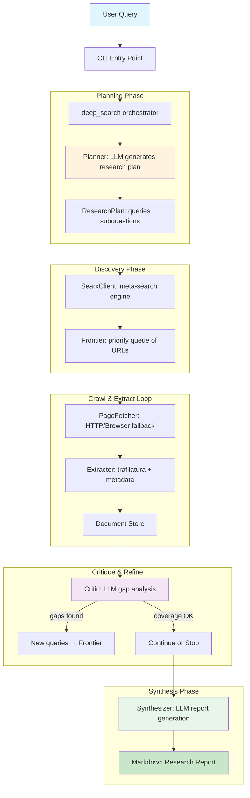
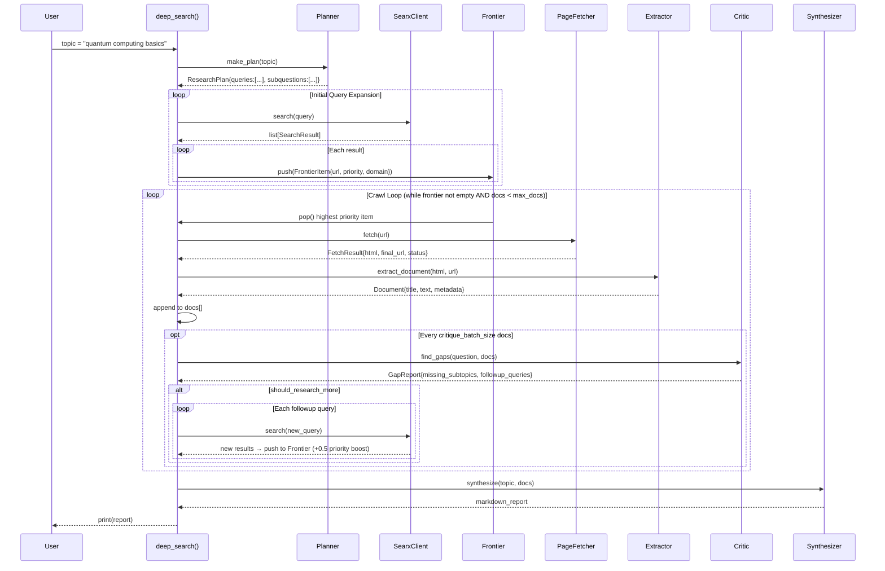
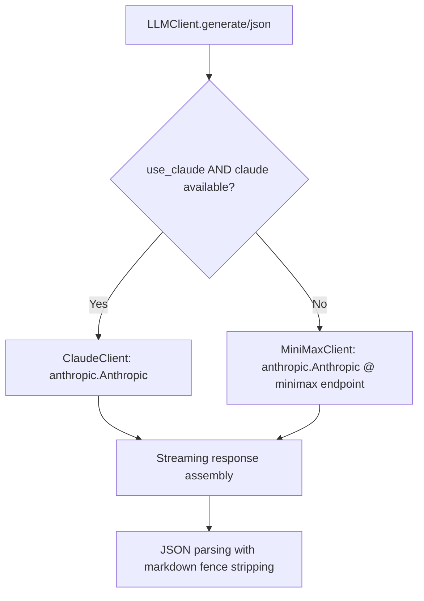

# DeepResearch System: Architecture & Execution Deep-Dive

## 🏗️ High-Level Architecture



---

## 🔁 Execution Flow (Step-by-Step)

### 1. Entry Point: [`cli.py:10-28`](deepresearch/cli.py:10)

```python
def main():
    topic = sys.argv[1] if len(sys.argv) > 1 else sys.stdin.read().strip()
    report = asyncio.run(deep_search(topic))  # ← Core async entry
    print(report)
```

- Accepts CLI args or stdin
- Runs the async `deep_search` coroutine
- Prints final markdown report

---

### 2. Orchestrator: [`deep_search.py:25-96`](deepresearch/deep_search.py:25)



---

## 🧩 Component Micro-Analysis

### [`config.py:9-22`](deepresearch/config.py:9) — Configuration

```python
@dataclass
class Config:
    searxng_base_url: str = "http://localhost:8080"  # Self-hosted meta-search
    minimax_api_key: str = os.getenv("MINIMAX_API_KEY")  # LLM provider
    minimax_model: str = "MiniMax-M2.7"  # Default model
    anthropic_base_url: str = "https://api.minimax.io/anthropic"  # Anthropic-compatible endpoint
    max_docs: int = 100  # Hard cap on collected documents
    critique_batch_size: int = 10  # Gap analysis frequency
    fetch_timeout: float = 20.0  # HTTP request timeout
    browser_wait_ms: int = 2000  # JS-render wait for browser fetch
```

- Uses `python-dotenv` for secrets management
- Dual LLM support: MiniMax (primary) + Claude (fallback)

---

### [`planner.py:14-29`](deepresearch/planner.py:14) — Research Planning

**Prompt Strategy**:

```python
SYSTEM_PROMPT = """You are a research planner. Given a topic, generate a structured research plan.
Return JSON with:
- topic: the original topic
- subquestions: list of key sub-questions to investigate
- queries: list of search queries to find relevant sources
- source_preferences: list of preferred source types (official, academic, journalism, industry)
- stop_conditions: object with max_docs, coverage_threshold
"""
```

- LLM decomposes topic → subquestions → executable search queries
- Output parsed via [`llm_client.json()`](deepresearch/llm_client.py:50) with markdown-code-block stripping

---

### [`searx_client.py:7-38`](deepresearch/searx_client.py:7) — Meta-Search

- Queries self-hosted [SearXNG](https://searxng.org) instance
- Returns normalized `SearchResult` objects
- Supports language/category filtering
- **Why SearXNG?**: Privacy-preserving, multi-engine aggregation (Google, Bing, DuckDuckGo, etc.)

---

### [`frontier.py:11-31`](deepresearch/frontier.py:11) — Crawl Frontier

```python
class CrawlFrontier:
    def push(self, item: FrontierItem):
        if item.canonical_url in self.seen: return  # Deduplication
        self.q.put((-item.priority, self._counter, item))  # Max-heap via negative priority
```

- **Priority scoring** ([`deep_search.py:14-24`](deepresearch/deep_search.py:14)):
  
  ```python
  def score_result(title, url, snippet) -> float:
      score = 1.0
      if any(k in title.lower() for k in ["research", "paper", "docs", "official", "report"]): score += 1.5
      if url.endswith(".pdf"): score += 1.0  # Academic preference
      if len(snippet) > 80: score += 0.2  # Content richness signal
      return score
  ```
- Follow-up queries get `+0.5` priority boost to address gaps faster

---

### [`fetcher.py:15-80`](deepresearch/fetcher.py:15) — Adaptive Page Fetching

```mermaid
graph LR
    A[fetch(url)] --> B{force_browser?}
    B -->|Yes| C[Playwright Chromium]
    B -->|No| D[httpx Async HTTP]
    D --> E{html < 500 chars?}
    E -->|Yes| C  # Fallback for JS-heavy sites
    E -->|No| F[Return HTTP result]
    C --> G[Wait for networkidle + 2s]
    G --> H[Return browser HTML]

    style C fill:#fff3e0
    style D fill:#e3f2fd
```

- **Retry logic**: Exponential backoff (`2^(attempt-1)` seconds)
- **Dual-mode**: Fast HTTP first → browser fallback for dynamic content
- Uses `playwright.async_api` for headless Chromium

---

### [`extractor.py:4-33`](deepresearch/extractor.py:4) — Content Extraction

- Leverages [`trafilatura`](https://trafilatura.readthedocs.io/) for boilerplate removal
- Extracts: `title`, `text`, `author`, `published_at`, `language`, raw `metadata`
- Handles JSON/meta-tag parsing fallbacks
- **Key params**: `favor_precision=True`, `include_tables=True`

---

### [`critic.py:14-33`](deepresearch/critic.py:14) — Gap Analysis Loop

```python
def find_gaps(self, question: str, docs: list[dict]) -> GapReport:
    # Summarize first 20 docs (truncated to 200 chars each)
    doc_summary = f"Total documents: {len(docs)}\n" + ...
    prompt = f"Question: {question}\n\n{doc_summary}\n\nReturn JSON gap analysis."
    data = self.llm.json(prompt, system=SYSTEM_PROMPT, use_claude=True)  # ← Uses Claude for critical thinking
```

- **Strategic choice**: Uses `use_claude=True` for higher-reliability gap detection
- Returns structured `GapReport` with:
  - `covered_subtopics` / `missing_subtopics`
  - `contradictions` (source conflicts)
  - `followup_queries` (new searches to fill gaps)
  - `should_research_more` (loop continuation flag)

---

### [`synthesizer.py:12-28`](deepresearch/synthesizer.py:12) — Report Generation

```python
def synthesize(self, topic: str, docs: list[dict]) -> str:
    # Build evidence block with citations [1], [2], ...
    evidence = ""
    for i, d in enumerate(docs):
        evidence += f"[{i + 1}] **{title}** | {author} | {published}\n  Source: {url}\n  Excerpt: {text[:500]}...\n\n"

    prompt = f"Topic: {topic}\n\nEvidence:\n{evidence}\n\nWrite the final research report in markdown format. Include citations like [1], [2]..."
    return self.llm.generate(prompt, system=SYSTEM_PROMPT, use_claude=False)  # ← Uses MiniMax for cost efficiency
```

- **Citation system**: Numeric references `[1]` mapped to source URLs
- **Evidence truncation**: 500-char excerpts to fit context window
- **Prompt engineering**: Explicit instructions for structure, objectivity, gap acknowledgment

---

### [`llm_client.py:123-160`](deepresearch/llm_client.py:123) — Dual-LLM Abstraction



- **Unified interface**: Both clients implement identical `generate()`/`json()` methods
- **Streaming**: Processes `content_block_delta` chunks for real-time token handling
- **JSON robustness**: Strips ```json fences before `json.loads()`

---

## 🔄 Key Design Patterns

| Pattern                  | Implementation                                          | Purpose                                     |
| ------------------------ | ------------------------------------------------------- | ------------------------------------------- |
| **Priority Queue Crawl** | [`frontier.py`](deepresearch/frontier.py:11)            | Focus resources on high-value sources first |
| **Adaptive Fetching**    | [`fetcher.py:53-79`](deepresearch/fetcher.py:53)        | Balance speed vs. JS-render compatibility   |
| **Iterative Refinement** | Critique loop at `len(docs) % critique_batch_size == 0` | Dynamically expand research based on gaps   |
| **LLM Specialization**   | Claude for critique, MiniMax for synthesis              | Optimize cost/quality tradeoffs per task    |
| **Deduplication**        | `canonical_url` + `seen` set in Frontier                | Avoid redundant crawling of same content    |

---

## ⚙️ Data Flow Summary

```
User Query
   ↓
[Planner] → ResearchPlan{queries: [...]}
   ↓
[SearxClient] × N queries → SearchResult[]
   ↓
[Frontier.push] → PriorityQueue(sorted by score_result)
   ↓
[Crawl Loop]
   ├─ Frontier.pop() → highest priority URL
   ├─ PageFetcher.fetch() → HTML (HTTP or browser)
   ├─ extract_document() → clean text + metadata
   ├─ Append to docs[]
   └─ Every 10 docs: [Critic] → GapReport
        ├─ If gaps: new queries → Frontier.push (+0.5 priority)
        └─ Else: continue until max_docs or frontier empty
   ↓
[Synthesizer] → Markdown report with [1], [2] citations
   ↓
Print to stdout
```

---

## 🔐 Security & Operational Notes

1. **API Keys**: Stored in `.env`, loaded via `dotenv` — never hardcoded
2. **Rate Limiting**: Implicit via `fetch_timeout=20s` and retry backoff
3. **SearXNG Dependency**: Requires self-hosted instance (privacy-focused alternative to direct search APIs)
4. **Browser Automation**: Playwright Chromium runs headless; ensure system has dependencies (`chromium`, `ffmpeg`)
5. **Context Window Management**: Evidence excerpts truncated to 500 chars; doc summaries limited to first 20 items for critique

---

## 🚀 Usage

```bash
# Direct CLI
python -m deepresearch.cli "quantum entanglement applications"

# Piped input
echo "latest advances in fusion energy" | python -m deepresearch.cli

# Programmatic
from deepresearch import deep_search, Config
report = asyncio.run(deep_search("topic", config=Config(max_docs=50)))


#Copy-Paste-Run
"""Test script for DeepSearch Research System."""
from __future__ import annotations
import asyncio
from deepresearch import deep_search


async def test_small():
    print("Testing with small config...")
    result = await deep_search(
        "Create me a detailed in-depth report on jeffry epstein , ...and how he made his fortune.", config={"max_docs": 40, "critique_batch_size":4}
    )
    print("Result:", result[:200], "...")
    with open("outputs/epstein_report.md", "w", encoding="utf-8") as file:
        file.write(result)
    return result


if __name__ == "__main__":
    asyncio.run(test_small())
```

This system implements a **closed-loop research agent**: plan → discover → critique → refine → synthesize. The iterative gap-analysis loop is its key differentiator from simple search+summarize tools, enabling deeper, more comprehensive coverage of complex topics.
