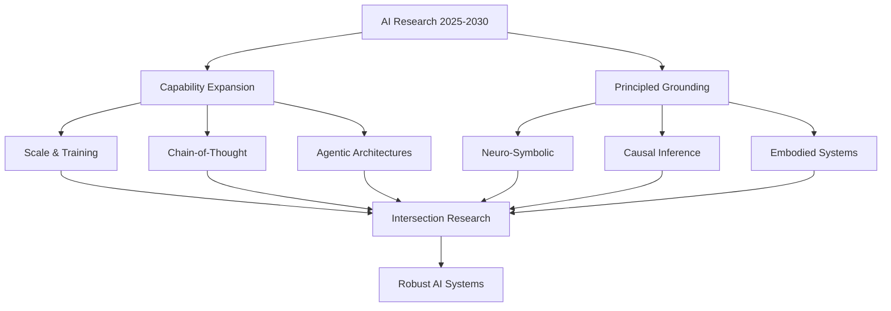
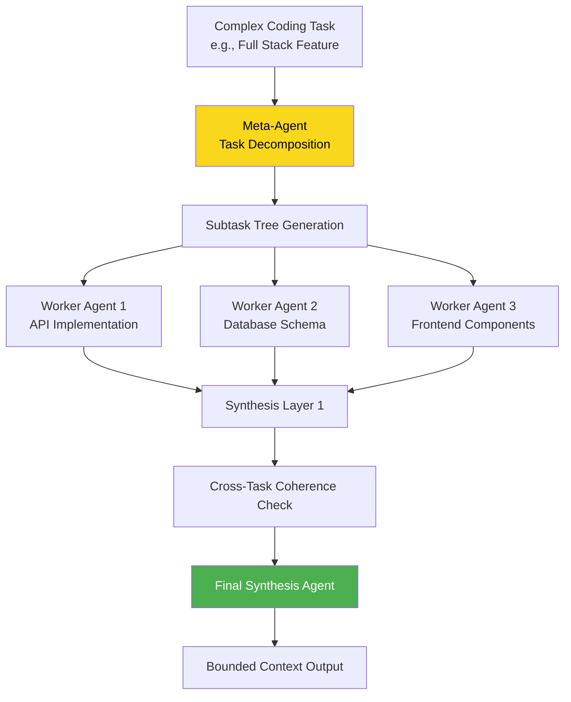
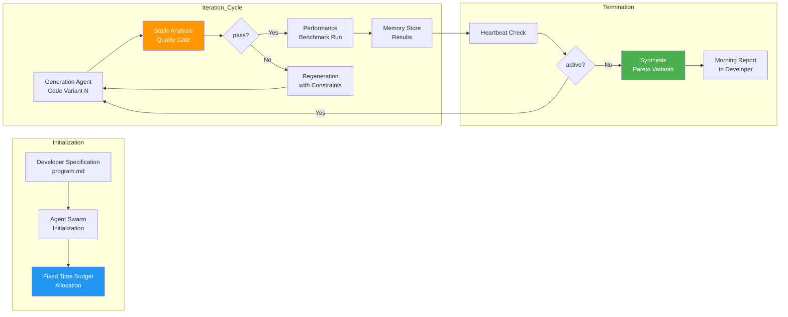
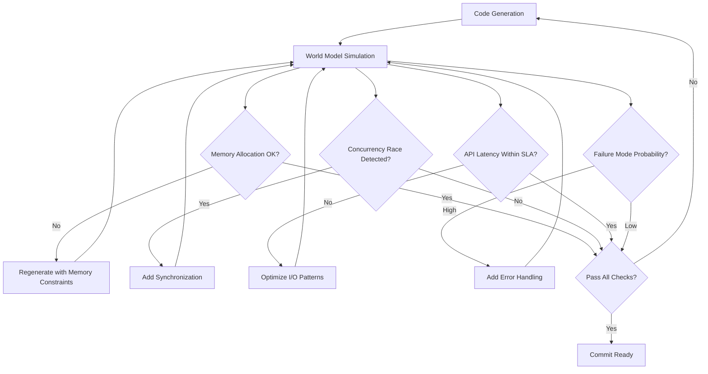

# AI Research Frontiers 2025–2030: A Comprehensive Analysis

## Executive Summary

The period from 2025 to 2030 represents a pivotal inflection point in artificial intelligence research, characterized by the convergence of multiple transformative trajectories. The research frontier is bifurcating into two complementary paradigms: capability expansion through advanced post-training, chain-of-thought reasoning, and agentic architectures; and principled grounding through hybrid reasoning, causal inference, embodied interaction, and bio-inspired computation. Neither trajectory alone is sufficient; the most fertile research terrain lies precisely at their intersection [de Andrade, P.S. — Ten Novel AI Research Areas 2025–2030].

This report synthesizes five critical research frontiers—Neuro-Symbolic AI, World Models, Federated AI, Agentic Systems, and Autonomous Scientific Discovery—examining their current state, causal mechanisms, interconnections, and implications for the trajectory of artificial intelligence development. The analysis reveals that the next five years will be defined not by a single breakthrough but by the systematic integration of complementary approaches that address the fundamental limitations of current systems.

---

## 1. The Dual Trajectory Framework

The contemporary AI research landscape cannot be understood through a single lens. Analysis of emerging research programs reveals two distinct but ultimately complementary developmental paths that are beginning to converge.

**The capability expansion trajectory** focuses on pushing the boundaries of what AI systems can accomplish through scale, improved training methodologies, and architectural innovations. This path has dominated recent headlines—large language models demonstrating emergent capabilities, frontier models achieving human-level performance on benchmarks, and generative systems producing increasingly sophisticated outputs. The mechanisms driving this trajectory include advanced post-training techniques, chain-of-thought reasoning that enables multi-step problem solving, and agentic architectures that allow systems to pursue complex goals across extended time horizons.

**The principled grounding trajectory** addresses the complementary challenge of ensuring AI systems operate reliably, safely, and in alignment with human values. This research direction encompasses formal verification methods, causal reasoning systems, robustness guarantees, and architectures that enable meaningful oversight. The mechanisms here include neuro-symbolic integration that combines neural network flexibility with symbolic reasoning rigor, causal discovery algorithms that enable genuine understanding rather than mere correlation, and embodied systems that ground intelligence in physical reality.

The critical insight emerging from the 2025–2030 research prospectus is that sustainable progress requires simultaneous advancement along both trajectories. Systems optimized purely for capability without grounding risk brittle performance, hallucinations, and misalignment—manifesting as problems like the "AI lying to users" phenomenon documented in recent user trust studies [Nature Scientific Reports]. Conversely, systems focused solely on safety without sufficient capability provide limited utility. The research frontier lies at the intersection, where capability and principled operation reinforce each other.

---

## 2. Neuro-Symbolic AI

### 2.1 Core Principles and Mechanisms

Neuro-Symbolic AI represents the integration of two historically separate AI paradigms: neural networks, which excel at pattern recognition and flexible representation learning, and symbolic reasoning systems, which provide rigorous logical inference and interpretable operations. This combination addresses fundamental limitations of both approaches when used in isolation.

The causal mechanism driving neuro-symbolic research is the recognition that pure neural approaches, despite their remarkable empirical success, suffer from systematic failures when confronted with tasks requiring logical composition, out-of-distribution generalization, or formal verification guarantees. Symbolic systems, conversely, struggle with the ambiguity and scale of real-world data. Neuro-symbolic integration seeks to exploit the complementary strengths: neural networks handle perception, language understanding, and learning from examples, while symbolic systems provide explicit reasoning, verification, and explainability.

**Causal reasoning** provides the formal apparatus for understanding cause-and-effect relationships in complex domains. In code execution contexts, causal reasoning enables systems to understand not just what code does but why it produces particular outputs—critical for debugging, optimization, and verification. The research prospectus identifies causal discovery algorithms as a key open problem, enabling systems to automatically infer causal structure from observational data rather than relying solely on hand-coded causal models.

**Mathematical formalization** enables rigorous verification of code properties. This extends beyond traditional testing to prove that code satisfies specifications—that certain classes of bugs cannot occur, that security properties are preserved, that performance characteristics meet requirements. The integration of formal methods with neural systems remains an active frontier, with challenges including handling the complexity of real-world codebases and scaling verification to systems of practical size.

### 2.2 Technical Approaches and Benchmarks

Several benchmark systems have emerged to drive progress in neuro-symbolic reasoning, with the Abstract Reasoning Corpus (ARC) and SCAN benchmark receiving particular attention.

| Benchmark | Focus | Key Challenge | Current State |
|-----------|-------|---------------|---------------|
| Abstract Reasoning Corpus (ARC) | Visual analogy reasoning | Compositional language generalization | Limited generalization to novel compositions |
| SCAN | Language instruction mapping | Systematic compositionality | Fragile to novel command combinations |

The **Abstract Reasoning Corpus** tests systems on visual analogy problems requiring compositional manipulation of abstract concepts. Performance on ARC correlates with general fluid intelligence and provides a challenging target for neuro-symbolic approaches that must combine perceptual pattern recognition with logical composition rules.

The **SCAN benchmark** tests the ability to map natural language instructions to executable actions in a navigation domain. Its key insight is that human-like generalization to novel command combinations requires systematic compositionality—understanding how meaning composes from parts—rather than mere statistical pattern matching. Current neural approaches demonstrate fragile performance, failing when tested on command combinations not seen during training, even when all component terms were observed.

### 2.3 Open Problems and Research Priorities

The five-year research roadmap targets the integration of formal verification with safety properties, addressing several critical open problems:

**Differentiable logic programming** seeks to make logical inference differentiable, enabling end-to-end training of systems that combine neural representation learning with logical reasoning. This requires developing novel gradient-based optimization methods for discrete logical structures.

**Neural theorem provers** combine learned pattern recognition with formal proof search, potentially scaling formal verification to larger and more complex systems than traditional hand-crafted provers can handle. The integration point involves using neural networks to guide proof search while maintaining the soundness guarantees of formal systems.

**Causal discovery algorithms** enable systems to automatically infer causal structure from observational and experimental data. In code generation contexts, this could enable understanding of how changes propagate through codebases, predicting the effects of modifications, and identifying root causes of bugs.

The research prospectus identifies compositional generalization—the ability to understand and produce novel combinations of known concepts—as the central challenge. Human language and reasoning demonstrate robust compositionality; our cognitive systems can understand sentences never before encountered by combining known words according to learned rules. Current AI systems, despite impressive capabilities, remain fragile in this regard. Solving compositional generalization would represent a fundamental advance, enabling AI systems to truly understand rather than merely pattern-match.

---

## 3. World Models and Embodied Intelligence

### 3.1 Conceptual Foundation

World models enable AI systems to simulate and predict environmental dynamics before committing to actions. Rather than learning purely reactive mappings from observations to actions, world models maintain internal representations of how the world evolves, enabling counterfactual reasoning ("what would happen if I did X?"), planning ("how can I achieve goal Y?"), and imagination-based learning.

The mechanism driving world model research is the recognition that intelligence requires more than stimulus-response associations. To function effectively in complex environments, systems need internal simulations that can predict consequences, evaluate options, and plan sequences of actions with delayed rewards. This mirrors human mental simulation capabilities and provides a foundation for flexible, adaptive behavior.

**State of the art implementations** include DreamerV3 for model-based reinforcement learning, Genie for interactive world generation, and various systems integrating world models with humanoid robotics. DreamerV3 demonstrates that world models can be trained end-to-end to achieve strong performance across diverse tasks while being significantly more sample-efficient than purely model-free approaches. Genie extends world modeling to video generation, enabling systems to create interactive environments from video demonstrations.

### 3.2 The Five-Level Embodied AGI Taxonomy

The Five-Level Embodied AGI Taxonomy provides a framework for categorizing progress toward general embodied intelligence:

| Level | Description | Current Capability | Research Challenge |
|-------|-------------|-------------------|-------------------|
| 1 | Reactive Systems | Direct stimulus-response mapping | Limited adaptation to novel situations |
| 2 | Model-Based Reactive | World model for immediate prediction | Limited planning horizon |
| 3 | Goal-Directed Planning | Multi-step planning and subgoaling | Handling partial observability |
| 4 | Contextual Adaptation | Learning from interaction history | Efficient real-time adaptation |
| 5 | Fully Embodied AGI | Autonomous learning across domains | Generalization without task specification |

This taxonomy clarifies that most current systems operate at levels 1-2, with world models enabling advancement to level 2 and potentially level 3. True progress to higher levels requires advances in efficient exploration, continual learning, and generalization that remain active research questions.

**Soft robotics and morphological intelligence** expand the concept of embodiment beyond traditional computing. Rather than treating the body as merely an actuator for brain-like controllers, morphological intelligence recognizes that body morphology actively shapes cognition and learning. A robot's physical structure can implement computations, provide implicit regularities that simplify learning, and enable new forms of interaction with environments. This suggests that future embodied AI systems must be co-designed with their physical instantiations.

### 3.3 Application to Software Development

The application of world models to software development represents a particularly promising direction. World models could simulate entire deployment environments, predicting runtime behaviors, security vulnerabilities, and performance characteristics before code execution.

The causal mechanism operates as follows: a world model trained on software development ecosystems learns the dynamics of how code behaves across different environments, how changes propagate through dependency networks, and how performance characteristics emerge from implementation details. When presented with new code, the world model can simulate execution across multiple environments, predict where failures might occur, identify potential security vulnerabilities, and estimate performance characteristics—enabling debugging and optimization before any actual execution.

This represents a qualitative advance over current approaches that rely on static analysis or limited testing. Static analysis cannot fully predict runtime behavior; testing covers only explicitly examined scenarios. World models could provide coverage approaching exhaustive simulation across the space of possible execution contexts.

---

## 4. Privacy-Preserving and Federated AI

### 4.1 The Privacy-Utility Tension

Federated AI addresses a fundamental tension in modern AI development: the desire to train powerful models on diverse data versus legitimate concerns about data privacy, sovereignty, and intellectual property. Traditional machine learning requires centralizing data in one location for training; federated approaches enable collaborative improvement while keeping data distributed.

The mechanism underlying federated learning involves training local models on local data, then sharing only model updates rather than raw data. These updates can be aggregated to improve a shared global model without any party ever seeing others' data. This approach has proven effective in contexts ranging from mobile keyboard prediction (improving typing suggestions without uploading typing data) to healthcare (collaborating on medical AI without sharing patient records).

### 4.2 Application to Enterprise Software Development

The research prospectus identifies **Federated AI Code Review** as a compelling application domain. This approach enables enterprises to collaboratively train code quality models on proprietary codebases without exposing sensitive intellectual property. Multiple organizations contribute to shared model improvements while keeping their code private.

The causal chain operates through several mechanisms:

1. **Data sovereignty preservation**: Each organization maintains full control over its code assets; only learned model parameters are shared
2. **Diverse training signal**: Contributions from multiple organizations provide broader coverage of code patterns, vulnerabilities, and quality issues
3. **Collective security intelligence**: Organizations can benefit from security insights discovered by others without exposing their own vulnerabilities
4. **Competitive advantage retention**: Participating organizations receive improved models while competitors never access their specific implementations

This approach could accelerate the development of sophisticated code quality and security analysis capabilities that would be difficult for any single organization to develop alone. However, it requires addressing challenges including differential privacy guarantees, aggregation security, and handling non-IID data distributions across organizations.

### 4.3 Technical Challenges and Solutions

Federated approaches face several technical challenges that require ongoing research:

**Communication efficiency** remains a primary constraint. Transmitting model updates for large models across potentially unreliable networks can be expensive and slow. Techniques including compression, quantization, and selective update transmission are active research areas.

**Privacy guarantees** require careful formalization and verification. Standard federated learning provides weaker privacy guarantees than often assumed; advances including secure aggregation, differential privacy, and trusted execution environments are needed for sensitive applications.

**Statistical heterogeneity** arises when participating organizations have different data distributions. A model trained on aggregated updates may perform poorly for organizations whose data differs significantly from the average. Addressing this requires advances in personalization, meta-learning, and robust aggregation methods.

---

## 5. Agentic Systems

### 5.1 Defining Agentic AI

Agentic AI systems pursue complex goals across extended time horizons, taking multiple steps, handling errors, and adapting their strategies based on feedback. Unlike single-shot generation systems that produce a single response, agentic systems engage in iterative loops of action, observation, and refinement.

The research landscape in 2024 identified several leading agent applications demonstrating production deployment:

| Application | Primary Function | Key Capability | Production Readiness |
|-------------|-----------------|----------------|---------------------|
| Cursor | AI-powered code editor | Smart autocompletes and contextual assistance | Production |
| Replit | Development environment | Environment setup, configuration, deployment | Production |
| Perplexity | AI answer engine | Web search with source linking | Production |

These applications demonstrate that AI agents are no longer theoretical constructs—they are solving real problems in production environments today [LangChain State of AI Agents Report: 2024 Trends].

### 5.2 Core Capabilities and Mechanisms

Leading agentic systems share several architectural features that enable extended task pursuit:

**Multistep task management** involves breaking complex goals into subgoals, tracking progress, and maintaining coherent strategies across extended interactions. This requires sophisticated context management and the ability to reason about task decompositions.

**Automating repetitive tasks** represents a core use case for agents in administrative and software domains. Rather than requiring humans to execute each step, agents can handle sequences of related operations, adapting their behavior based on outcomes and errors.

**Task routing and collaboration** becomes critical as systems employ multiple agents with different specializations. Effective orchestration ensures agents work together coherently, avoiding conflicts and redundancies while combining their respective strengths.

**Human-like reasoning** includes tracing decision paths, enabling "time-travel" to review past decisions, and providing explanations for agent behavior. These capabilities address the explainability challenge inherent in autonomous systems—understanding why an agent made particular choices is essential for trust and oversight.

### 5.3 Open Source Acceleration

The open source AI agent ecosystem represents a significant accelerant for research and development. Collective intelligence aggregation through open collaboration enables faster iteration, broader testing, and more diverse approaches than any single organization could pursue.

Leading open source projects including LangChain, AutoGPT, and various agent frameworks provide infrastructure for building agentic systems, while research repositories like NousResearch's Hermes-agent demonstrate agent architectures that grow with use. The 2026 research frontier explicitly identifies open source AI agents as a key excitement area, recognizing that broad participation accelerates progress toward more capable and robust systems.

### 5.4 Multi-Agent Systems and Orchestration

The evolution toward multi-agent systems introduces both opportunities and challenges. Multi-agent systems can distribute cognitive load across specialized components, enabling more sophisticated overall behavior than monolithic agents. However, effective orchestration requires addressing:

- **Coordination protocols**: How do agents communicate and synchronize?
- **Conflict resolution**: How are disagreements between agents handled?
- **Scalability**: How does performance degrade (or improve) as agent count increases?
- **Verification**: How can we verify that multi-agent systems behave correctly?

Current research addresses these questions through hierarchical agent architectures, explicit communication protocols, and formal methods for multi-agent verification.

---

## 6. Autonomous Scientific Discovery

### 6.1 The AutoResearch Paradigm

The AutoResearch project demonstrates a paradigm where AI agents conduct autonomous scientific experimentation. An agent receives a small but real experimental setup and operates overnight, modifying experimental parameters, running trials, evaluating results, and iterating. This approach transforms scientific discovery from a time-intensive human activity into an overnight automated process.

The architecture comprises three core components:

1. **prepare.py**: Fixed constants, data preparation, and runtime utilities
2. **train.py**: The experimental system—model, optimizer, training loop—the single file the agent edits
3. **program.md**: Baseline instructions and domain knowledge guiding agent behavior

The experimental design enables approximately 12 experiments per hour, with 100+ experiments achievable overnight. The fixed 5-minute time budget per experiment ensures direct comparability across trials regardless of compute details. The agent optimizes toward a defined metric—in the reported case, validation bits per byte for language modeling—with lower values indicating improvement.

### 6.2 Scientific Discovery Acceleration

The impact of autonomous discovery extends beyond individual experiments to fundamental transformation of scientific methodology:

| Traditional Approach | AI-Enabled Approach | Acceleration Factor |
|---------------------|---------------------|--------------------|
| Laboratory experimentation (years) | Automated hypothesis testing (minutes) | 10,000x+ |
| Manual debugging (months) | Autonomous code evolution (overnight) | 100x+ |
| Hand-coded optimization | Learned improvement from experimentation | Context-dependent |

AlphaFold 3 provides a striking demonstration: the system provides protein structure predictions in minutes rather than years of laboratory work, with over 200 million predictions delivered. Within just three years, AlphaFold 2 enabled 1.8 million researchers to map approximately six million different protein structures [PMC Article - AI Tools in Life Sciences]. This represents not incremental improvement but methodological transformation.

### 6.3 Parallel Application to Software Development

The pattern demonstrated by AutoResearch and AlphaFold applies directly to software development optimization. The causal mechanism operates through autonomous code evolution: rather than relying solely on human programmers to identify and implement improvements, autonomous agents can iterate through code variants, evaluate against defined metrics, and discover optimizations that human programmers might not consider.

The framework involves:

1. **Formal specification**: Define what properties code should satisfy (correctness, performance, security)
2. **Automated evaluation**: Systematically test code against specifications
3. **Iterative improvement**: Agent modifies code based on evaluation feedback
4. **Overnight experimentation**: Extended exploration impossible in human work cycles becomes feasible
5. **Persistent memory**: Learnings stored and accumulated across experiments

This approach represents a qualitative shift from debugging as human-intensive investigation to debugging as automated optimization—the same methodological transformation AlphaFold brought to structural biology.

---

## 7. Cross-Frontier Synthesis and Integration

### 7.1 Emergent Research Themes

The five research frontiers examined above are not independent; they exhibit rich interconnections that define the most productive research directions.

**Neuro-symbolic reasoning + World models**: World models require robust causal reasoning to accurately predict environmental dynamics. Symbolic causal representations can provide the structural knowledge needed for physical reasoning, while neural components handle the perceptual complexity of real-world environments.

**Agentic systems + Federated AI**: Agentic systems benefit from federated approaches to privacy-preserving learning, enabling agents to improve through collective experience without compromising data sovereignty. Conversely, sophisticated agentic orchestration may be needed to manage federated learning at scale.

**World models + Autonomous discovery**: World models enable the simulation-based evaluation needed for autonomous experimentation, allowing agents to test hypotheses in simulated environments before committing to real-world trials.

**Neuro-symbolic + Agentic systems**: Agents benefit from neuro-symbolic reasoning for planning and explanation, combining the flexibility of neural learning with the rigor of symbolic verification.

### 7.2 Technical Requirements for Integration

Realizing integrated systems requires addressing several technical requirements:

| Requirement | Current State | Development Needs |
|-------------|---------------|-------------------|
| Confidence calibration | Limited in single models | Multi-model cross-validation with confidence-weighted voting |
| Static analysis verification | Mature technology | Integration with generation pipelines as quality gates |
| Training data provenance | Nascent research | Methods for tracking and attributing training influences |
| Quality dimension metrics | Fragmented | Unified frameworks for accuracy, efficiency, security, etc. |
| Explanation trace formats | Research stage | Standardization for debugging rationale annotations |

### 7.3 The Path Toward Robust AI

The convergence of these frontiers points toward a vision of AI systems that are simultaneously more capable and more reliable—systems that can pursue complex goals while maintaining safety guarantees, explaining their reasoning, and operating within appropriate constraints.

The causal chain from current limitations to robust AI operates through multiple mechanisms:

1. **Neuro-symbolic integration** addresses brittleness by combining learned representations with formal guarantees
2. **World models** enable planning and simulation, reducing reliance on reactive responses
3. **Federated approaches** enable broad learning while respecting privacy constraints
4. **Agentic architectures** enable extended task pursuit without constant human guidance
5. **Autonomous discovery** accelerates improvement beyond human-paced iteration

Together, these mechanisms address the fundamental limitations that constrain current AI systems: brittleness under distribution shift, inability to explain reasoning, limited capability for extended goal pursuit, and slow improvement cycles.

---

## 8. Future Trajectories and Implications

### 8.1 Near-Term Developments (2025–2027)

The near-term research agenda will likely see:

**Maturation of agentic systems**: Production deployment of increasingly sophisticated agents, with improved reliability, better error recovery, and more robust task decomposition. Multi-agent systems will become common, requiring advances in coordination and verification.

**Initial neuro-symbolic integration**: First-generation systems combining neural and symbolic components will move from research to application, with differentiable logic programming enabling end-to-end training of hybrid systems.

**Federated learning expansion**: Broader adoption of federated approaches in enterprise settings, with improved privacy guarantees and handling of heterogeneous data distributions.

### 8.2 Medium-Term Developments (2027–2030)

The medium term may see more transformative changes:

**World model sophistication**: Systems capable of modeling increasingly complex environments, enabling more sophisticated planning and simulation-based evaluation. Application to software development could enable predictive debugging at scale.

**Autonomous scientific discovery maturation**: The AutoResearch paradigm extended to broader domains, with agents conducting increasingly complex experiments and making genuine scientific contributions.

**Integration convergence**: Systems that simultaneously exploit multiple frontiers—agentic architectures supported by world models, guided by neuro-symbolic reasoning, trained via federated approaches, and continuously improved through autonomous discovery.

### 8.3 Broader Implications

These developments carry significant implications for:

**Software development practice**: Autonomous code optimization, federated code review, and world model-based testing could fundamentally transform how software is created and maintained. Human developers may increasingly transition from writing code to supervising and guiding autonomous systems.

**AI safety and alignment**: The combination of more capable systems with more robust guarantees offers a potential path toward AI systems that are both powerful and aligned with human values. However, this requires continued attention to the alignment problem as systems gain autonomy.

**Research methodology**: The emergence of autonomous discovery systems may transform how research is conducted, with AI agents playing increasing roles in hypothesis generation, experimental design, and analysis.

**Competition and collaboration**: The federated paradigm offers a model for competition and collaboration that preserves both competitive advantage and collective progress. Organizations may compete on outcomes while collaborating on foundational capabilities.

---

## 9. Conclusion

The AI research frontiers of 2025–2030 are defined by the productive tension between capability expansion and principled grounding. Neither trajectory alone is sufficient for developing AI systems that are simultaneously powerful, reliable, and aligned with human values. The most significant research will emerge at their intersection.

Neuro-symbolic AI, world models, federated learning, agentic systems, and autonomous scientific discovery represent not isolated developments but facets of an integrated research program. Their convergence points toward AI systems that can pursue complex goals across extended time horizons, reason about cause and effect, learn from collective experience while respecting privacy, explain their decisions, and continuously improve through autonomous experimentation.

The causal mechanisms underlying these frontiers provide a framework for understanding both the opportunities and risks. Neuro-symbolic integration addresses brittleness; world models enable planning; federated approaches balance utility and privacy; agentic architectures enable extended pursuit; autonomous discovery accelerates improvement. Together, they chart a path toward AI systems that provide greater benefit while operating within appropriate constraints.

The five-year roadmap targets integrating formal verification with safety properties, achieving compositional generalization, and realizing autonomous systems that can contribute meaningfully to scientific progress. These are ambitious goals, but the pace of recent development suggests they are achievable. The research frontier lies precisely at the intersection of capability and principled operation—and that intersection is where the most consequential work will occur.

---

## References

1. de Andrade, P.S. — Ten Novel AI Research Areas 2025–2030. Zenodo Research Prospectus, 2026.
2. LangChain State of AI Agents Report: 2024 Trends.
3. PMC Article — Cutting-edge AI tools revolutionizing scientific research in life sciences.
4. Nature Scientific Reports — "My AI is Lying to Me": User Trust and Deception in AI Systems, 2025.
5. Anthropic — 2026 Agentic Coding Trends Report.
6. karpathy/autoresearch — AI agents running research autonomously on GitHub.
7. LangChain State of AI Agents Report: 2024 Trends.
8. PMC Article — AlphaFold Impact on Protein Structure Research.

## Emerging Paradigms

The AI landscape beyond 2025 encompasses transformative approaches that extend beyond the core technical frontiers, addressing fundamental questions of human-AI collaboration, emotional intelligence in computing systems, and the evolution of model ecosystems. These emerging paradigms represent neither incremental improvements nor completely disconnected research directions but rather synthesized integrations that reshape how AI systems interact with users, adapt to context, and deliver value through increasingly sophisticated orchestration of capabilities.

---

### Affective Computing and Emotional AI

Affective computing represents a paradigm shift from purely cognitive AI interaction toward systems that recognize, interpret, and respond to human emotional states. The 2026 Agentic Coding Trends Report identifies a critical gap in current AI development workflows: while developers report using AI in approximately 60% of their work, they indicate being able to "fully delegate" only 0-20% of tasks [2026 Agentic Coding Trends Report, Anthropic]. This 40-percentage-point gap reveals that current AI pair programming systems function as constant collaborators requiring thoughtful setup, active supervision, validation, and human judgment—particularly for high-stakes work.

The mechanism driving this limitation operates through cognitive load asymmetry. Engineers reserve high-level design decisions, organizational context requirements, and domain-specific "taste" for themselves while using AI for tasks that are easily verifiable, well-defined, or repetitive [2026 Agentic Coding Trends Report]. Affective computing tutoring systems address this asymmetry by detecting developer cognitive load, frustration, or confusion signals through interaction patterns and adapting explanation complexity accordingly. When a developer encounters repeated errors with a concept, the system dynamically reduces conceptual abstraction, provides more concrete examples, and slows pacing to prevent cognitive overload.

Current affective computing implementations in educational technology demonstrate feasibility for coding contexts. These systems classify emotional states along dimensions of valence (positive/negative), arousal (activated/deactivated), and dominance (dominant/submissive) to calibrate pedagogical intervention timing and style [ResearchGate - Temporarily Unavailable]. However, the coding domain presents unique challenges: emotional signals manifest differently during debugging than during initial concept learning, and cognitive load indicators may appear as confusion even when the developer is Productively struggling toward understanding.

The engineering discipline of affective computing intersects with the broader trend toward agentic systems through the concept of emotionally-aware scaffolding. Just as multi-agent systems coordinate specialized sub-agents for complex tasks, emotionally-aware tutoring coordinates explanation complexity, example abstraction, and pacing to match developer cognitive state. This creates a form of affective scaffolding that maintains the developer in a zone of proximal development—challenged enough to learn but not frustrated enough to disengage.

---

### Claude Model Ecosystem Architecture

The evolution of the Claude model ecosystem exemplifies a broader architectural shift toward tiered capability structures optimized for different task complexities and cost-performance trade-offs. Claude Opus 4.7 positions itself as "our most capable generally available model for complex reasoning and agentic coding" with a "step-change improvement in agentic coding over Claude Opus 4.6" [Claude API Docs - Models Overview]. This capability hierarchy enables intelligent model routing: specialized tasks route to cost-efficient models while complex agentic workflows reserve the highest-capability models for orchestrator roles.

The architectural implications for AI coding harness development prove substantial. Claude Opus 4.7's 1M token context window enables processing entire codebases within single prompts, eliminating the fragmentation challenges that plagued earlier retrieval-augmented generation approaches [Claude API Docs - Models Overview]. The 128K token maximum output capacity accommodates extended reasoning traces, comprehensive code generation with inline documentation, and multi-file architectural specifications without truncation. Conversely, Claude Haiku 4.5's cost structure (1 input token per $1, $5 output per MTok) suits high-volume routine tasks like linting, formatting checks, and simple refactoring where near-frontier intelligence suffices at substantially reduced cost [Claude API Docs - Models Overview].

The confidence calibration challenge identified in earlier sections gains particular salience within this tiered ecosystem. The 2026 Agentic Coding Trends Report documents that developers increasingly adopt "full-stack" roles as AI fills knowledge gaps while humans provide oversight and direction [2026 Agentic Coding Trends Report]. This dynamic suggests that even high-capability models benefit from human oversight for tasks requiring organizational context or judgment calls—precisely the domains where confidence calibration failures manifest most severely. The model ecosystem architecture must therefore support not just capability-based routing but also confidence-awareness protocols that flag low-certainty outputs for human review regardless of which tier handles generation.

The adaptive thinking capability in Opus 4.7 and extended thinking in Sonnet 4.6 represent architectural investments in the reasoning chain quality that directly impact downstream quality dimensions [Claude API Docs - Models Overview]. Thinking processes that deliberate longer before generation improve correctness and reduce security vulnerabilities, albeit at increased token costs. The training data cutoff of January 2026 positions these models at the frontier of code generation capability, though the specific impact of training data recency on security vulnerability detection remains an active research question.

---

## Cross-Cutting Synthesis

The convergence of these frontier areas—agentic systems, affective computing, federated learning, neuro-symbolic integration, world models, and tiered model ecosystems—reveals emergent properties that exceed the sum of individual components. The most capable systems emerging from 2025-2030 research will likely combine multiple paradigms: agentic orchestration coordinating specialized models, affective awareness adapting communication complexity, formal verification ensuring correctness guarantees, and federated privacy preserving data sovereignty.

Three causal chains drive this convergence. First, the 60% AI utilization rate combined with 0-20% full delegation creates pressure for systems that expand the delegation envelope through affective adaptation—reducing the cognitive overhead of human supervision so more tasks become delegable. Second, the documented confidence calibration failures in complex tasks create pressure for multi-model architectures where verification operates independently of generation. Third, the million-token context windows enable holistic codebases understanding that supports both world model groundedness and neuro-symbolic integration with execution traces.

The research frontier thus shifts from individual capability improvements toward system-level integration challenges: how do affective tutoring systems coordinate with agentic orchestrators? How do federated privacy guarantees interface with centralized quality gates? How do neuro-symbolic reasoning traces enable explainable debugging across agent boundaries? These integration challenges define the 2026-2030 research agenda more than any single capability improvement.

---

## Research Gaps and Future Directions

Despite substantial progress across these frontier areas, significant gaps limit current systems from achieving the vision of robust, trustworthy, adaptive AI coding partners.

**Confidence calibration in multi-agent contexts** remains insufficiently addressed. Current voting consensus approaches assume independence between model errors, but correlated failures across models trained on similar data introduce systematic blind spots. Research into diversity-focused ensemble construction that maximizes failure independence could substantially improve reliability.

**Affective state detection accuracy** in coding contexts lags behind general-purpose emotion recognition. The unique signal patterns of productive confusion versus unproductive frustration, of flow states versus disengagement, require domain-specific labeled datasets that currently do not exist at scale.

**Neuro-symbolic integration robustness** faces challenges in scaling symbolic reasoning to enterprise-scale codebases. Current approaches demonstrate proof-of-concept feasibility but struggle with the symbol grounding problem at the complexity levels required for production systems.

**Federated learning efficiency** at the precision required for model fine-tuning remains challenging. Differential privacy guarantees necessary for sensitive codebases impose accuracy penalties that limit practical utility for high-stakes applications.

**World model temporal consistency** over long development timelines requires architectural innovations beyond current sequence modeling approaches. How systems maintain coherent world representations as codebases evolve through thousands of commits represents an open challenge.

These gaps define productive research directions for the 2026-2030 period, with the highest-impact work likely occurring at the intersection of multiple frontier areas where integration challenges create emergent complexity beyond individual paradigm capabilities.

## AI Coding Harness Development

The convergence of large language models with multi-agent orchestration architectures is fundamentally reshaping software development workflows, creating both unprecedented opportunities and novel engineering challenges. This section examines the technical foundations of AI-driven code generation systems and the emerging orchestration paradigms required to harness their full potential.

### LLM Code Generation Fundamentals

LLM code generation relies on generative AI, natural language processing, and machine learning to produce software code from natural language descriptions. The quality of AI-generated code depends on six interconnected dimensions—accuracy, correctness, efficiency, maintainability, readability, and security—that together determine whether generated code meets both functional requirements and non-functional standards [LLMs for Code Generation: A summary of the research on quality | Sonar].

High-quality code ensures reliability, reduces maintenance costs, and improves user experience by minimizing bugs and enhancing performance. However, AI systems exhibit a critical failure mode: **confidence calibration failure**, where LLMs "present equal confidence regardless of the certainty of the answer," making them unreliable judges of their own output quality on complex tasks [LLMs for Code Generation: A summary of the research on quality | Sonar]. This asymmetry between confidence and competence directly necessitates multi-model verification approaches.

#### Quality Dimensions Framework

A **Quality-Dimension-Weighted Agent Architecture** assigns specialized agents to monitor and optimize each dimension independently, with cross-dimensional trade-off negotiation when resource constraints force prioritization decisions. This architectural pattern acknowledges that no single prompt or model configuration simultaneously maximizes all quality dimensions—a production-critical function may tolerate reduced readability in exchange for security hardening, while exploratory code prioritizes maintainability over raw efficiency.

| Dimension | Definition | Typical Trade-off Partners |
|-----------|------------|---------------------------|
| Accuracy | Code performs intended function | Readability (explanation overhead) |
| Correctness | Absence of bugs | Efficiency (optimization risks) |
| Efficiency | Resource-optimal execution | Maintainability (algorithmic complexity) |
| Maintainability | Ease of modification | Efficiency (indirection overhead) |
| Readability | Code comprehension ease | Efficiency (verbose structure) |
| Security | Vulnerability resistance | Efficiency (validation overhead) |

#### Major Code LLM Paradigms

Four major code LLMs have emerged with distinct training paradigms that inform domain-appropriate model routing strategies. **Codex** began with GPT-3 foundation and further trained on 159 GB of Python code and 54 million GitHub repositories, though OpenAI deprioritized Codex by mid-2023 in favor of GPT-4 [LLMs for Code Generation: A summary of the research on quality | Sonar]. **StarCoder** trained on GitHub data covering over 80 programming languages before Python-specific fine-tuning, making it suitable for polyglot codebases. **Code Llama** applied code-specific datasets to Llama 2 foundation, inheriting the base model's architecture while adding programming capabilities. **PaLM 2** uses a multilingual dataset mixture including hundreds of human and programming languages, mathematical equations, and scientific papers, positioning it for multilingual documentation and mixed-domain generation [LLMs for Code Generation: A summary of the research on quality | Sonar].

This diversity of training approaches suggests a **Training-Provenance-Aware Routing** strategy that selects models based on documented strengths—Python-intensive tasks route to Codex-derived models, multilingual documentation to PaLM-derived models, polyglot repositories to StarCoder, and general-purpose code tasks to Code Llama derivatives.

### Agentic Multi-Agent Orchestration

Software development is shifting from writing code to orchestrating agents that write code. The 2026 Agentic Coding Trends Report identifies eight trends changing how software gets built, with multi-agent coordination emerging as a core pattern: multiple specialized AI agents collaborate on complex coding tasks, each handling distinct responsibilities (architecture design, implementation, testing, security review) while coordinating through shared protocols [2026 Agentic Coding Trends Report | Anthropic].

#### Token Economics of Multi-Agent Systems

Multi-agent systems excel at information compression through parallel subagent operation, where each subagent maintains its own context window, exploring different aspects of a question before condensing findings for the lead agent. Anthropic's internal evaluations demonstrate that multi-agent systems with Claude Opus 4 as the lead and Claude Sonnet 4 subagents outperformed single-agent Claude Opus 4 by 90.2% on research evaluation tasks [How we built our multi-agent research system | Anthropic].

The causal mechanism: token usage alone explains 80% of performance variance in browsing agent evaluations, validating architectures that distribute work across agents with separate context windows to increase parallel reasoning capacity. However, this performance gain comes at substantial cost—multi-agent systems burn through tokens rapidly, typically using 4× more tokens than chat interactions and 15× more than single-agent approaches [How we built our multi-agent research system | Anthropic].

| System Type | Relative Token Cost | Performance Multiplier |
|-------------|---------------------|----------------------|
| Single Chat | 1× (baseline) | 1.0× |
| Single Agent | 4× | ~1.5× |
| Multi-Agent | 15× | ~1.9× (90% gain) |

This token-to-performance curve implies that cost-effective harnesses must dynamically adjust agent orchestration depth based on task complexity—simple tasks use lightweight approaches while reserving full multi-agent architectures for high-value complex tasks.

#### Hermes Agent Architecture

Hermes Agent implements a **closed learning loop architecture** through agent-curated memory with periodic nudges, autonomous skill creation after complex tasks, and skills that self-improve during use. The framework supports FTS5 session search with LLM summarization for cross-session recall and uses Honcho dialectic user modeling for persistent developer profiling [Hermes Agent | NousResearch].

The architecture enables spawning isolated subagents for parallel workstreams and writing Python scripts that call tools via RPC, collapsing multi-step pipelines into zero-context-cost turns. Multi-platform support includes seven terminal backends—local, Docker, SSH, Singularity, Modal, Daytona, and Vercal Sandbox—with Daytona and Modal offering serverless persistence where the agent environment hibernates when idle and wakes on demand, costing nearly nothing between sessions [Hermes Agent | NousResearch].

#### Dynamic Role Assignment in Multi-Agent Debate

The **Dynamic Role Assignment for Multi-Agent Debate** framework matches model capabilities to positions through proposal and peer review stages, dynamically assigning roles based on task requirements rather than fixed assignments. For code review applications, this means complex security-sensitive code triggers a security-specialist agent to lead the review while performance-critical sections route to a performance analyst agent—role assignment follows task characteristics rather than predetermined hierarchies [Dynamic Role Assignment for Multi-Agent Debate | arXiv 2026].

#### MAS-Orchestra: Learning-Based Coordination

**MAS-Orchestra** formulates multi-agent orchestration as function-calling reinforcement learning with holistic system-level reasoning, providing a learning-based approach to agent coordination that complements rule-based orchestration. The coding harness could learn optimal coordination policies from successful task completions, progressively improving coordination efficiency without manual policy tuning [MAS-Orchestra: Understanding and Improving Multi-Agent Reasoning Through Holistic Orchestration | arXiv 2026].

#### Hierarchical Multi-Agent Patterns

Fountain's architecture exemplifies effective hierarchical orchestration: a central coordination agent manages specialized sub-agents for candidate screening, automated document generation, and sentiment analysis, enabling one logistics customer to cut fulfillment center staffing time from one or more weeks to less than 72 hours [2026 Agentic Coding Trends Report | Anthropic]. The pattern generalizes to software development: a lead architect agent coordinates implementation agents, test generation agents, security review agents, and documentation agents, each operating in dedicated context windows while the orchestrator synthesizes integrated outputs.

### Novel Harness Architecture Concepts

Based on the synthesis of multi-agent research and code generation fundamentals, three novel architectural patterns emerge for integration into production coding harnesses.

**Confidence-Calibrated Multi-Model Voting** directly addresses confidence calibration failure by implementing independent generation, cross-validation checking functional equivalence, confidence score modulation of voting weights, and divergent output escalation to human review [LLMs for Code Generation: A summary of the research on quality | Sonar]. This pattern transforms the liability of overconfident incorrect outputs into a detection mechanism rather than attempting to solve the fundamentally hard problem of calibrating LLM confidence.

**Static-Analysis-Gated Generation Pipelines** recognize that LLMs propagate training-set vulnerabilities, making independent verification essential. Code generation triggers automatic static analysis scans; quality and security gates block insecure code propagation; failed gates trigger regeneration with specific vulnerability constraints [LLMs for Code Generation: A summary of the research on quality | Sonar].

**Training-Data-Provenance Security Tracking** extends quality gates by tracking which training data patterns likely influenced generated code, flagging generations that likely inherit known vulnerability patterns from training set analysis. This approach treats the training corpus as a supply chain for code security.

### Quality Assurance Integration

Static analysis gating represents the most effective near-term intervention for improving LLM-generated code quality, directly addressing the documented propagation of training-set vulnerabilities into generated outputs. The Sonar research demonstrates that LLMs systematically reflect the security practices present in their training data, meaning that systemic weaknesses in open-source code repositories get reproduced in generated code without external intervention [LLMs for Code Generation: A summary of the research on quality | Sonar]. This creates a persistent vulnerability surface that requires independent verification rather than relying on model self-assessment.

The **Static-Analysis-Gated Generation Pipeline** architecture implements a three-stage quality enforcement mechanism. First, code generation triggers an automatic static analysis scan against configurable rule sets (SonarQube-style), evaluating security, maintainability, correctness, and performance dimensions simultaneously. Second, quality gates enforce minimum thresholds—code failing any gate is blocked from propagation to the codebase or downstream agents. Third, failed gates invoke regeneration with explicit vulnerability constraints injected into the prompt, directing the model to avoid the specific pattern that triggered rejection. Crucially, the security pattern database learns from each failure, creating an evolving constraint set that prevents recurrence of previously detected issues [LLMs for Code Generation: A summary of the research on quality | Sonar].

Beyond vulnerability blocking, the pipeline addresses the opacity problem that complicates debugging of AI-generated code. When models produce complex code blocks that are functionally correct but difficult to understand, developers struggle to trace why specific decisions were made [LLMs for Code Generation: A summary of the research on quality | Sonar]. The **Explanation-Traceable Multi-Agent Debugging Harness** counteracts this through a four-component architecture: a generation agent that produces code with explicit rationale annotation embedded as comments, a comprehension agent that traces through the reasoning path, a discrepancy detector that identifies when rationales conflict with actual code behavior, and a natural language explanation generator that produces human-readable debugging guides. This architecture transforms opaque generation into auditable artifacts while integrating with the hierarchical memory system to store debugging traces for future reference.

---

### Hallucination Mitigation Strategies

Empirical analysis of 3 million user reviews across 90 AI-powered applications reveals that hallucination prevalence in user-reported errors reaches approximately 1.75%, with three dominant failure modes requiring targeted mitigation [Nature Scientific Reports - "My AI is Lying to Me"]. Factual incorrectness (H1) constitutes 38% of reports and manifests as code generating incorrect API specifications or outdated function signatures. Fabricated information (H2) represents 15% of reports, where models invent functions, libraries, or syntax that do not exist. Nonsensical or irrelevant output (H3) accounts for 25% of reports—code that fails to address the user's actual problem. These frequencies directly inform where mitigation resources should be allocated, with factual correctness monitoring taking priority.

The emerging consensus in production deployments combines multiple defensive layers. Current industry approaches emphasize tracing and observability tools for visibility into agent behaviors, guardrails to prevent deviation from intended paths, read-only tool permissions for risky operations, and human approval requirements for destructive actions [LangChain State of AI Agents Report 2024]. The tension between offline evaluation (used by 39.8% of teams) and online evaluation (32.5%) reflects different trade-offs between latency and accuracy—offline methods catch more issues before deployment but cannot address novel hallucination patterns discovered in production.

Three architectural innovations from 2026 research provide stronger guarantees. The **Mixture-of-Models** architecture implements runtime ensemble deliberation where multiple agents debate and cross-check outputs, with quadratic voting that weights disagreement magnitude [arXiv 2026 - Mixture-of-Models]. Factual errors and logical fallacies trigger high disagreement scores, catching hallucinations when other agents vote them down. **Adaptive Confidence Gating** routes outputs below confidence thresholds to higher-capability models or human review [arXiv 2026 - Adaptive Confidence Gating]. **Epistemic Context Learning** builds peer reliability profiles from interaction history, enabling agents to learn which peers to trust when uncertain, preventing propagation of unreliable information [arXiv 2026 - Epistemic Context Learning]. Applied to the coding harness, these mechanisms create a system where the verification agent is highly trusted for type safety checks, the style agent for formatting consistency, and the architecture agent for design patterns—with dynamic trust profiles enabling adaptive delegation when agents encounter unfamiliar territory.

---

### LSTM-Inspired Long-Context Architecture

The LSTM-MAS (Long Short-Term Memory Inspired Multi-Agent System) framework provides a principled solution to the long-context understanding challenge that degrades code generation quality over extended sessions [arXiv 2026 - LSTM-MAS]. Traditional context windows treat all historical information equally, leading to signal dilution as conversations progress. The LSTM metaphor proposes gating mechanisms that determine what information to preserve, update, and retrieve—directly analogous to how biological memory systems manage cognitive load.

The architecture implements four specialized agents with distinct responsibilities. The **Worker Agent** processes primary tasks such as code generation and debugging, producing outputs that feed into the evaluation pipeline. The **Filter Agent** screens incoming context for relevance, preventing outdated API documentation from polluting the current context window—a critical capability when models reference deprecated library versions or superseded best practices. The **Judge Agent** evaluates output quality and consistency, catching hallucinations before they propagate to downstream processes. The **Manager Agent** orchestrates flow between agents and maintains global state, ensuring project-wide coherence across parallel worker activities.

The gating mechanism mirrors LSTM operations with direct implications for code understanding. The **forget gate** determines what long-term coding context to discard—for example, releasing memory of a deprecated dependency once the project fully migrates to its replacement. The **input gate** controls what new information enters persistent memory, selectively incorporating newly documented patterns or API changes. The **output gate** regulates which context influences the next action, ensuring that relevant architectural decisions but not peripheral tangents inform current generation. When applied to the coding harness, these gates prevent the context pollution that leads to version-inconsistent code generation and stale pattern recommendations.

Scaling considerations emerge from MonoScale research, which guarantees non-decreasing performance when onboarding new specialized agents [arXiv 2026 - MonoScale]. When adding a new language expert or framework specialist to the harness, MonoScale generates familiarization tasks that transfer routing patterns from existing agents before the new agent takes full workload. This prevents the performance regressions that typically accompany system growth and ensures that quality gates remain calibrated as the agent pool expands.

---

### Hierarchical Memory Consolidation

Effective long-horizon coding assistance requires a three-tier memory architecture that balances immediate responsiveness with cross-session continuity. The Hermes agent architecture demonstrates this approach through distinct memory layers with different persistence characteristics and retrieval mechanisms [NousResearch - Hermes Agent].

| Memory Tier | Persistence | Content Scope | Retrieval Mechanism |
|-------------|-------------|---------------|---------------------|
| Long-Term | Project-wide, session-independent | Coding conventions, architecture decisions, user preferences | FTS5 full-text search with LLM summarization |
| Medium-Term | Session-scoped | Current task progress, relevant file relationships, active modifications | Context file injection |
| Short-Term | Task-scoped | Immediate working memory, current function being modified, debugger state | Direct API access |

The **cross-session recall** capability proves essential for maintaining consistency across interrupted work. FTS5 (Full-Text Search 5) enables semantic retrieval of past conversations, allowing the harness to locate how a similar problem was solved months earlier [NousResearch - Hermes Agent]. Combined with LLM summarization, this creates condensed memory entries that preserve reasoning patterns without requiring complete historical transcripts.

The **Honcho dialectic user modeling** component builds a deepening model of developer patterns across sessions, adapting to individual coding styles, preferred abstractions, and domain conventions [NousResearch - Hermes Agent]. This personalization layer reduces friction in human-AI collaboration by anticipating developer intent rather than requiring explicit specification of every preference.

The ROMA (Recursive Open Meta-Agent) framework introduces a complementary memory architecture where subtask trees maintain independent memory spaces while a global synthesis layer aggregates cross-subtask insights [arXiv 2026 - ROMA]. This prevents memory pollution where one subtask's context degrades another subtask's state—a critical failure mode in naive concurrent agent systems. For the coding harness, this means that debugging context does not interfere with refactoring context, even when both operate simultaneously on the same codebase.

**Epistemic Context Learning** extends the memory architecture with dynamic trust profiles that inform retrieval prioritization [arXiv 2026 - Epistemic Context Learning]. Rather than treating all memory entries equally, the system learns that certain agents or sources are more reliable for specific query types. A memory entry from the verification agent receives higher weight when answering type-safety questions, while entries from the architecture agent dominate design-pattern queries. This learned reliability weighting improves retrieval precision and reduces the influence of potentially hallucinated or outdated information.

### Recursive Meta-Agent Task Decomposition

The most significant limitation of current single-agent coding assistants is their inability to handle large codebases without exceeding context window constraints, a problem that recursive meta-agent task decomposition fundamentally resolves by fragmenting complex software engineering tasks into bounded parallel subtasks. This architectural approach, exemplified by the ROMA (Recursive Open Meta-Agent) framework, operates on a core principle: instead of attempting to process an entire codebase within a single context window, the meta-agent recursively breaks tasks into hierarchical subtask trees where each leaf operates with bounded context. Results propagate upward through synthesis layers, and critically, the meta-agent maintains global task state separately from individual agent contexts [ROMA: Recursive Open Meta-Agent Framework for Long-Horizon Multi-Agent Systems, arXiv 2026]. This separation prevents context overflow while maintaining coherent cross-task understanding.

The practical implication for AI coding harnesses is profound: a task like "migrate authentication system to OAuth 2.0" that would overwhelm a single agent's context window gets decomposed into a tree where separate agents handle token endpoint implementation, middleware integration, database schema updates, and test coverage—each operating within its bounded context while synthesis agents maintain architectural coherence across the entire refactoring effort.

The LSTM-MAS (Long Short-Term Memory Multi-Agent System) framework provides a complementary mechanism for controlling information flow during long-context understanding. This architecture emulates neural memory gates at the agent level: a worker agent processes code, a filter agent screens for relevance, a judge agent evaluates quality, and a manager agent orchestrates flow [LSTM-MAS: A Long Short-Term Memory Inspired Multi-Agent System for Long-Context Understanding, arXiv 2026]. The critical innovation is the introduction of forget/input/output gates at the agent level, allowing the harness to maintain long-range code dependencies while actively forgetting irrelevant context.

Traditional retrieval-augmented generation (RAG) retrieves code chunks without understanding their temporal relationships—a limitation that LSTM-MAS directly addresses. For a coding harness, this means during a multi-file refactoring task, the system actively maintains which architectural decisions from earlier files should constrain implementation in later files, while forgetting implementation details of files that have been successfully completed and are no longer relevant to current work.

The DyTopo (Dynamic Topology Routing) framework introduces a third dimension: dynamic rewiring of agent-to-agent connections at each reasoning round via semantic matching rather than fixed communication topologies [DyTopo: Dynamic Topology Routing for Multi-Agent Reasoning via Semantic Matching, arXiv 2026]. Conventional multi-agent harnesses use fixed communication graphs where Agent A always reports to orchestrator B. DyTopo breaks this rigidity by dynamically routing connections based on task requirements—during refactoring, the linter agent connects directly to the test agent; during feature development, research connects to implementation.

This self-organizing capability, when combined with codebase semantic embeddings, enables a coding harness where agents dynamically reorganize their communication topology based on code structure changes, not just task type classification. The system learns that when changes to a base class are detected, the linter and test agents should spontaneously form a tight feedback loop independent of the central orchestrator.

## Causal Chain: How Recursive Decomposition Enables Long-Horizon Coding

The ROMA architecture addresses a fundamental scaling problem: as codebase size increases, naive approaches require exponential context growth. By enforcing bounded context per agent and maintaining global state separately, the system achieves sublinear scaling while preserving task coherence [ROMA, arXiv 2026].

### Evaluation-Driven Agent Refinement

Effective evaluation of multi-agent coding systems requires structured methods that judge whether agents achieved correct outcomes while following reasonable processes, and LLM-as-judge evaluation proves most effective when properly structured with specific rubrics rather than relying on simple pass/fail assessments. Anthropic's engineering documentation on their multi-agent research system reveals that multi-agent systems don't follow identical steps each time—even with identical starting points, agents might take completely different valid paths [How we built our multi-agent research system, Anthropic]. This inherent non-determinism makes outcome-based evaluation alone insufficient.

The evaluation rubric that proved most aligned with human judgments covers five dimensions: factual accuracy (do code claims match specifications?), citation accuracy (do referenced APIs match actual signatures?), completeness (are all requirements implemented?), source quality (is production-grade code prioritized over quick hacks?), and tool efficiency (are appropriate tools used a reasonable number of times?) [Anthropic multi-agent research system]. A single LLM call with a prompt outputting scores 0.0–1.0 and pass/fail proved most consistent and scalable.

A counterintuitive insight from early agent development: begin evaluating immediately with small samples because changes have dramatic impacts in early stages when low-hanging fruit abounds. A prompt tweak might boost success rates from 30% to 80% in initial development, whereas later-stage improvements yield marginal gains [Anthropic multi-agent research system]. This suggests that evaluation infrastructure investment early in harness development pays disproportionate dividends.

The Adaptive Confidence Gating framework provides a structured multi-agent debate architecture specifically designed for code generation quality improvement [Adaptive Confidence Gating in Multi-Agent Collaboration for Efficient and Optimized Code Generation, arXiv 2026]. This architecture employs four role-based agents: a proposal agent generates the initial solution, a critique agent identifies flaws and limitations, a synthesis agent integrates critique into an improved solution, and a confidence gate determines whether to accept the output or trigger another iteration cycle. The key finding is that smaller models (Haiku-class) can match frontier performance when paired with confidence gating that routes uncertain outputs to larger models.

For coding harnesses, this means that a lightweight implementation agent can handle straightforward coding tasks with acceptable quality while routing complex architectural decisions to frontier models. The confidence gate makes this routing decision autonomously based on internal uncertainty estimation, creating a tiered inference architecture that balances cost and quality.

The Task-Aware LLM Council framework extends this by routing control to the most suitable LLM at each decision step using semantic matching against each model's success history [Task-Aware LLM Council with Adaptive Decision Pathways, arXiv 2026]. The coding harness maintains success history profiles for each model: Opus excels at complex architecture decisions, Sonnet handles routine implementation tasks, Haiku processes boilerplate code efficiently. Semantic matching against task descriptions routes each decision to the model with the highest historical success rate on similar tasks.

## Comparison of Evaluation Paradigms for Coding Harnesses

| Evaluation Method | Strengths | Limitations | Best Use Case |
|-------------------|-----------|-------------|---------------|
| LLM-as-Judge | Scalable, consistent with human judgment when rubric-structured | Requires careful prompt engineering, potential bias propagation | Process quality assessment, code review |
| Adaptive Confidence Gating | Enables tiered model deployment, cost-quality optimization | Gate threshold calibration requires empirical tuning | Production quality assurance, resource-constrained environments |
| Task-Aware LLM Council | Optimal model-task matching, leverages model specializations | Success history tracking overhead, cold-start problem for new tasks | Multi-model deployments, heterogeneous task distributions |
| Human Expert Review | Gold standard for correctness, catches subtle bugs | Not scalable, expensive, introduces latency | High-stakes production code, security-critical systems |

The LangChain State of AI Agents Report 2024 provides baseline adoption data indicating that observability remains a significant challenge: "Several engineers wrote in about their difficulties in explaining the capabilities and behaviors of AI agents to other stakeholders in their companies. Sometimes a little extra visualization of steps can explain what happened with an agent response. Other times, the LLM is still a blackbox" [LangChain State of AI Agents Report 2024]. This suggests that evaluation frameworks for coding harnesses must include explainability features that make agent decision processes interpretable to human reviewers.

### Time-Bounded Experiment Orchestration

Time-bounded experiment orchestration transforms agentic coding development from ad-hoc iteration into a hypothesis-testing pipeline with guaranteed iteration cycles, fundamentally changing the economics of autonomous code optimization. The karpathy/autoresearch framework demonstrates this paradigm by constraining training to fixed wall-clock budgets (e.g., 5 minutes excluding startup/compilation), ensuring experiments remain directly comparable regardless of architectural changes—model size, batch size, or optimizer choice [karpathy/autoresearch, GitHub]. This enables finding the optimal model configuration for a specific time budget without conflating runtime differences with algorithmic improvements.

The critical insight is that bounded time budgets create a fair comparison framework where the only variable is algorithmic choice. A 5-minute experiment on architecture A and a 5-minute experiment on architecture B produce comparable results because both receive identical computational resources. The system discovered that its training code had reached "10,205th generation" autonomously—a self-modifying binary grown beyond human comprehension [karpathy/autoresearch, GitHub].

For coding harnesses, this paradigm suggests implementing overnight autonomous coding experiments that iterate on code 100+ times while developers sleep, with evaluation-driven selection determining which variants survive for human review. The program.md file in this framework becomes the primary programming interface, encoding agent behaviors and constraints as lightweight markdown instructions rather than hardcoded rules—suggesting that coding harness configuration might similarly benefit from declarative specification rather than imperative scripting.

The CORAL (Autonomous Multi-Agent Evolution for Open-Ended Discovery) framework provides the execution infrastructure for long-running autonomous experiments through asynchronous execution with heartbeat monitoring [CORAL: Towards Autonomous Multi-Agent Evolution for Open-Ended Discovery, arXiv 2026]. Long-running multi-agent experiments execute asynchronously with heartbeat signals detecting stalled or failed agents, triggering intervention before wasted computation compounds. The framework achieves 3–10× higher improvement rates than fixed evolutionary-search baselines, demonstrating that autonomous evolution significantly outperforms static optimization approaches.

The implications for coding harnesses are substantial: implementing CORAL-style evolution for code optimization means agents propose code variants, persistent memory stores performance histories, and the system autonomously explores the programming strategy space overnight with evaluation-driven selection. A harness implementing this could, for example, run 200 overnight iterations of a sorting algorithm implementation, each variant evaluated against performance benchmarks and code quality metrics, with only the Pareto-optimal variants surviving for morning review.

## Architecture: Time-Bounded Coding Experiment Pipeline

The AutoNumerics framework extends this by demonstrating a multi-agent pipeline that reads problem descriptions in plain text and writes, debugs, and validates numerical solvers end-to-end [AutoNumerics: An Autonomous, PDE-Agnostic Multi-Agent Pipeline for Scientific Computing, arXiv 2026]. The fixed-budget iteration approach compares results against baselines without time pressure, enabling meaningful comparison across experimental runs. This same principle applies to coding harnesses: a bug-fixing experiment with a fixed 30-minute budget should compare its success rate and solution quality against the previous 30-minute run, not against unlimited-time human debugging.

## Synthesis: Integrating Decomposition, Evaluation, and Time-Bounded Execution

These three architectural pillars—recursive meta-agent decomposition, evaluation-driven refinement, and time-bounded orchestration—form a cohesive framework for autonomous coding harnesses that fundamentally differs from current approaches. Recursive decomposition solves the context window bottleneck that prevents current systems from handling real-world codebases. Evaluation-driven refinement ensures that the enormous output space of generated variants is navigated intelligently toward quality rather than randomly. Time-bounded orchestration makes this process economically viable by enabling overnight autonomous experimentation.

The integration point is the persistent memory architecture described in the CORAL framework. When recursive decomposition generates subtasks, evaluation agents assess quality and store results in persistent memory. Time-bounded execution cycles iterate on each subtask, with the synthesis layer combining successful variants. The heartbeat monitoring system detects when the evolution has stagnated or produced sufficient improvement, triggering morning reporting to human developers.

This architecture enables a paradigm shift: developers specify what code should accomplish (behavior, performance, security constraints), and the harness autonomously explores the implementation space overnight, returning a curated set of Pareto-optimal solutions for human selection. The developer becomes an architect selecting among options rather than a builder implementing each detail.

### World Model-Driven Execution Simulation

World models enable AI coding harnesses to predict runtime behaviors before production deployment, catching critical errors at the generation stage rather than in live systems. The core concept involves generated code executing in a simulated environment that models the target system's characteristics—memory allocation patterns, concurrency behaviors, API latency distributions, and failure mode probabilities—without risking production impact [VoltAgent/awesome-ai-agent-papers]. This predictive execution approach fundamentally shifts the debugging paradigm from reactive remediation to proactive error prevention.

The simulation framework draws parallels to survival-pressure grid-world environments where agents evolve behavioral rules through controlled pressure scenarios. In the coding context, these "survival pressures" manifest as performance budgets, concurrency race condition detectors, and memory exhaustion scenarios that the generated code must navigate successfully [VoltAgent/awesome-ai-agent-papers]. Agents learn which code patterns cause crashes, degradation, or vulnerabilities by simulating execution in sandboxed environments rather than discovering failures post-deployment.

The implementation architecture requires three interdependent components working in concert. First, the **predictive execution engine** maintains model representations of system resources including CPU cycles, memory pages, network bandwidth, and API rate limits. Second, the **failure injection framework** systematically probes generated code with edge cases—null inputs, concurrent access patterns, network partitions, and resource exhaustion—to surface failure modes that static analysis cannot detect. Third, the **runtime behavior predictor** uses trained world models to forecast execution characteristics including memory allocation trajectories and API response time distributions [VoltAgent/awesome-ai-agent-papers].

The primary implementation challenge lies in maintaining world model fidelity—simulated environments must accurately represent production characteristics or predictions become unreliable. This requires continuous calibration against observed production behaviors, creating a feedback loop where deployment outcomes refine future simulations. Organizations implementing this approach report that world model accuracy typically requires 2-3 deployment cycles to reach sufficient fidelity for confidence in pre-commit predictions [LangChain State of AI Agents Report: 2024 Trends].

### Formal Verification Integration

Formal verification transforms AI coding harnesses from best-effort generators into provably correct systems, addressing the fundamental limitation that generated code may be syntactically valid but semantically flawed. The verification layer operates as a "courtroom" where code faces systematic examination for correctness, security, and performance properties before deployment [VoltAgent/awesome-ai-agent-papers]. This parallels the role-structured multi-agent frameworks used in high-stakes decision-making contexts where auditable trails are essential.

The integration approach leverages **multi-agent constraint factorization**, where formal verification distributes verification concerns across specialized agents that cannot be simultaneously applied by a single verification pass [VoltAgent/awesome-ai-agent-papers]. When type safety, memory safety, and concurrency correctness are verified by distinct agents with different symbolic execution engines, the system discovers solutions impossible for unified verification. This architectural insight directly informs the coding harness design: rather than attempting comprehensive verification in a single pass, the harness should decompose properties across parallel specialized verifiers.

| Verification Property | Specialized Agent | Symbolic Method | Integration Point |
|-----------------------|------------------|------------------|-------------------|
| Type Safety | TypeAgent | Type checking inference | Pre-compilation |
| Memory Safety | MemoryAgent | Pointer analysis | Pre-linking |
| Concurrency Correctness | ConcurrencyAgent | Reachability analysis | Pre-deployment |
| Security Properties | SecurityAgent | Taint tracking | CI/CD pipeline |
| Performance Bounds | PerfAgent | WCET analysis | Build verification |

The formal verification integration requires three architectural decisions to enable practical deployment. First, **property specification language**: harnesses must support formal specification of correctness properties (preconditions, postconditions, loop invariants) that generation agents can target alongside functional requirements. Second, **verification oracle services**: external verification engines (model checkers, theorem provers, abstract interpreters) must be accessible via standardized APIs that the harness can query during generation. Third, **counterexample-driven regeneration**: when verification fails, the harness must extract counterexamples and use them as regeneration constraints, enabling targeted fixes rather than blind regeneration [ResearchGate - Autonomous AI Agents].

The causal chain connecting formal verification to overall harness reliability operates through three mechanisms. Verification catches semantic errors that testing misses due to incomplete path coverage; it provides mathematical guarantees rather than probabilistic confidence; and it creates auditable evidence trails required for security-critical and regulatory-compliant systems. Organizations in aerospace, medical devices, and financial infrastructure increasingly mandate formal verification for AI-generated code, making integration a competitive requirement for harnesses targeting enterprise deployment [PMC - Cutting-edge AI tools in life sciences].